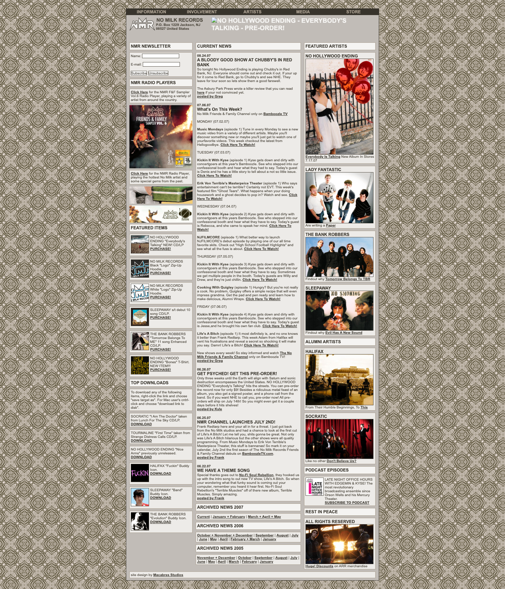
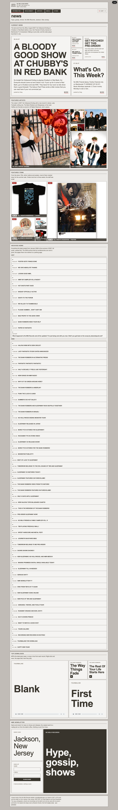
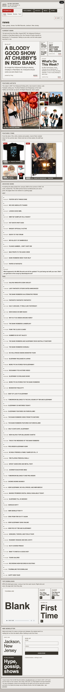
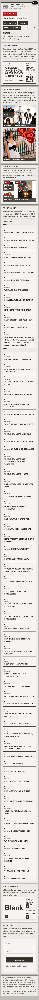

# Layout study 05 — No Milk Records

**Live:** https://gregoryedgerton.github.io/golden-grids-study-05-nmr/

A layout study of the No Milk Records website, nmr.gifcommit.com, as it
stood in 2007: the DIY punk and emo label Greg Edgerton and Kyle
Kraszewski ran from Jackson, New Jersey, between 2005 and 2007. The whole
site, 104 pages of news, bands, releases, reviews, tours, store, audio,
video, icons and wallpapers, is rebuilt as seventeen pages of golden grids.
The copy, photographs, artwork, recordings and video are the label's own and
are used with its owner's permission; this is the one study in the series
built from its reference's actual content. Built with
[Golden Grids](https://github.com/gregoryedgerton/golden-grids) from the
[study template](https://github.com/gregoryedgerton/golden-grids-study-template).

## Reference

https://nmr.gifcommit.com/news.shtml and every page linked from it, crawled
2026-10-06 ([`captures/extract.py`](captures/extract.py) turns the pages
into [`src/data/site.json`](src/data/site.json)); 334 assets mirrored under
`public/nmr/`, the three QuickTime videos re-encoded to H.264. Captures of
the news, releases, tours, store, Halifax and audio pages at 1440 are in
[`captures/`](captures/), with the rebuild at three widths as
`study-<page>-<width>.png`.

| Width | Reference (news) | Rebuild (news) |
| --- | --- | --- |
| 1440px |  |  |
| 820px | |  |
| 390px | |  |

The original is a fixed 760px page on a tiled grey damask: a left column of
newsletter, radio players, featured items and top downloads; a middle column
for the page; a right column of featured artists, alumni, podcast and a
memorial. Arial at 12px, lowercase bold section titles, 1px borders on every
image. The 2005 news archive lived on nomilkrecords.com and is gone; that
domain now redirects to a parking page.

## The claim

A DIY label's site is a stack of modules of unequal weight, a lead story, a
roster, a catalogue, a store, and the three-column template of the time
gave each the same column. Here every module is a band whose squares say
which thing matters most, the side columns become bands placed where a page
wants a break, and nothing on the site is left out.

## The pages

Seventeen HTML files, no router, the original's five navigation groups on
every page. Bands run full width; squares the content does not fill carry
type, a catalogue number, a running time, a word, rather than standing
empty.

| Page | Bands |
| --- | --- |
| News (`index`) | Current news 1–5 (newest largest); Featured artists 1–6; Featured items 1–5; the archive, 64 posts 2006–2007, as a list that opens in place; Top downloads 1–4 with players; Newsletter 1–3 |
| Band ×9 | Profile 1–4 (video or photo, bio, members, hometown); the band's records, filled to three with catalogue numbers; its MP3s; Video 1–2 where there is video; Buddy icons and wallpapers up to 1–8; the band in the store; related links; the rest of the roster |
| Releases | The latest five 1–5; the first eight 1–8; the store |
| Reviews | Seven records' press as a list, each open in place with its cover |
| Tours | Bands on tour 1–4 by dates; 45 dates as a list |
| Store | Browse by artist (a select that filters the page) and category tabs; CDs, T-shirts, posters, buttons, a hoodie, a hat, one band per category, 37 items, squares the items do not fill carrying the lowest price and the shipping time; every item opens to a product view with the picture large, price and sale tag, description, item code, availability by size, a size select, a quantity, and an Add to cart that is present and disabled; the store policy |
| Audio | 14 MP3s in three bands of five, every square playable: the native player where there is room for it, a single play control with the time where there is not, one song at a time; a list at 390 |
| Media | Buddy icons in three bands of eight, two squares of type and six icons each; wallpapers 1–8 at full size; three videos 1–3; the podcast |
| Information | Contact 1–3; FAQ, jobs, street team and links as lists and prose |

Every image, cover, item and post opens in place; a poster's film plays on
request; every MP3 plays where it sits. The navigation is the original's
five groups as a bar of dark tabs of one size: each drops down on hover,
focus or click, the page's own group is marked in red, and an empty cart
sits at the end saying the checkout is retired. On a phone the groups
stack and the page's own is open. Breakpoints live in
[`src/lib/viewport.ts`](src/lib/viewport.ts).

## Register

The site's own, from its `low_style.css`: the damask tiled behind a boxed
page, panels of `#edebe8` and `#f5f4f2` on `#c1bcb7`, 1px `#38342c` rules,
Arial. Type is raised from the original's 12px to a 15px body with 16–17px
lessons and standfirsts, and the fitted headlines are capped at 120px so
the set reads as one: body copy and captions are meant to carry as much as
the headline. The site had one scheme; dark follows the device with the
same greys turned over under the same pattern.

## How it works

- **Content.** `captures/extract.py` parses each page's middle column into
  sections, sanitises the HTML to paragraphs, links, images and lists,
  rewrites asset URLs to the mirror, and lifts posts, bands, releases,
  tours, store items and songs into records. Prose that is not lifted is
  rendered as it was written ([`src/lib/Prose.tsx`](src/lib/Prose.tsx)).
- **Type fits its square** ([`src/lib/fit.tsx`](src/lib/fit.tsx)); body copy
  comes in two lengths and the square's height picks one; nothing is cut.
- **Media.** Clips of the three videos play in their squares, the whole
  video on request ([`src/lib/clip.tsx`](src/lib/clip.tsx)); the MP3s play
  from `<audio>` elements with `preload="none"`; wallpapers open at full
  size with a download link.
- **Checks.** `captures/scan.cjs` is clean on all seventeen pages in Chrome
  and WebKit at 390, 820 and 1440 in both schemes: nothing overflows its
  box, no fitted line under 12px, no axe-core violations with a card open.
  Found and fixed on the way: a `--bg` token that gave expanded cells the
  page ground and failed contrast; nav links under 24px; crawl headings
  that broke heading order.

## What did not

- **The 2005 archive is lost**, and with it the label's first year.
- **Banners are missing.** The banner pages were linked with single-quoted
  hrefs the crawler did not follow; the ads themselves are mirrored but not
  shown.
- **The store does not sell.** Items, prices, sizes and availability are
  there and the controls work; the PayPal checkout is retired, so Add to
  cart is disabled and says so.
- **Eight-square bands cannot hold words.** Audio at 820 and 1440 moved to
  bands of five, and at 390 to a list, because the smallest of eight squares
  is 40px.
- **Buddy icons are 50px.** Shown at up to 320px they are pixel art; two
  squares of type take the sizes they could not fill.
- **The side columns are gone.** The newsletter, players, featured items and
  artists recur on every page of the original; here each appears once per
  page as a band, which loses the original's constant presence of the
  roster.

## Study tools

A floating panel (top right) toggles grid outlines (`g`), band notes (`n`,
which carry each band's range and placement) and reduced motion (`m`,
which stills the video clips).

## Running and deploying

```bash
npm install
npm run dev
```

`npm run build` type-checks and builds all seventeen pages to `dist/`;
pushing to `main` deploys to GitHub Pages. The library is consumed from npm
at its published version.
